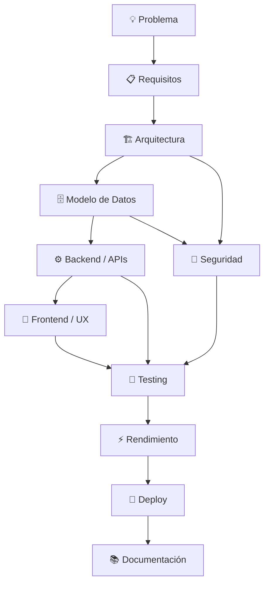

👋 Hola, soy Adán Trinidad

 

  

 Sobre mí

<table>
<tr>
<td width="62%" valign="top">

Soy Técnico egresado en Análisis de Sistemas y desarrollador Full Stack, enfocado en convertir problemas reales en soluciones de software completas.

Trabajo desde el modelo de datos y la lógica de negocio hasta la interfaz, seguridad, pruebas, automatización y despliegue.

Me interesan especialmente los sistemas donde se cruzan:

🌐 Desarrollo web Full Stack
🤖 IA, agentes, MCP y automatización
🗄️ PostgreSQL, Supabase, SQL y arquitectura de datos
🔐 Seguridad, RBAC, RLS y control de acceso
🪟 Windows, C#, .NET, WinUI 3 y Win32
📱 Android y desarrollo móvil
⚡ Rendimiento, testing y arquitectura escalable

</td>
<td width="38%" valign="top">

🎯 Mi enfoque

Diseñar
   ↓
Construir
   ↓
Medir
   ↓
Optimizar
   ↓
Documentar

Software útil, mantenible, seguro y preparado para evolucionar.

</td>
</tr>
</table>

## 🚀 Proyectos destacados

### 🖥️ [Real-Time Desktop Agent](https://github.com/Adan0423/real-time-desktop-agent)

> **Desktop AgentOS / Computer Use Runtime para Windows 11** diseñado para proporcionar visión, percepción y control de escritorio en tiempo real a sistemas y agentes de IA.

  
  
  
  
  
  
  

**Capacidades principales**

- ⚡ **Control nativo:** mouse, teclado y hotkeys mediante Win32.
- 👁️ **Percepción en tiempo real:** captura continua y análisis del escritorio.
- 🧠 **DesktopSession persistente:** mantiene activa la sesión entre la IA y Windows.
- 🔲 **ROI Processing:** procesa únicamente regiones visuales modificadas.
- 🔔 **Eventos nativos:** seguimiento de cambios de ventana y foco mediante WinEvents.
- 🔌 **Integración con IA:** MCP, REST API y comunicación WebSocket.
- 🧪 **Quality Engineering:** pruebas automatizadas y benchmarks de rendimiento.

  

---

### ⚡ [MemoraX](https://github.com/Adan0423/MemoraX)

> Aplicación nativa para **Windows 11** orientada a visualizar y administrar Standby Memory, junto con monitorización de memoria y hardware en tiempo real.

  
  
  
  
  
  

**Capacidades principales**

- 🧹 **Standby Memory:** visualización y limpieza manual controlada.
- 💾 **RAM Monitor:** memoria total, utilizada, disponible y Standby.
- 🌡️ **Hardware Monitoring:** temperatura y métricas de CPU/GPU.
- 🪟 **Floating Widget:** panel compacto Always-On-Top.
- 📊 **Dashboard:** interfaz moderna basada en Fluent Design y Mica.
- 🔧 **Windows Native APIs:** integración mediante Win32, NT API y P/Invoke.
- 🧩 **Arquitectura MVVM:** separación clara entre UI, estado y servicios.

  

---

### 🧰 [dev-toolkit-skills](https://github.com/Adan0423/dev-toolkit-skills)

> Colección modular de **skills, prompts y workflows reutilizables para agentes de IA**, diseñada para asistir diferentes etapas del ciclo de desarrollo de software.

  
  
  
  
  
  

**Áreas cubiertas**

- 🎨 **UI/UX Engineering:** diseño moderno, responsive y sistemas visuales.
- ⚛️ **Frontend:** React, Tailwind CSS, Vite y patrones de arquitectura.
- 🗄️ **Backend & Data:** Supabase, PostgreSQL, autenticación y optimización.
- 🔐 **Security:** auditoría, permisos, RBAC, RLS y revisión de vulnerabilidades.
- 🤖 **Automation:** agentes, workflows y automatización del desarrollo.
- 📚 **Documentation:** README, documentación técnica y mantenimiento de proyectos.
- 🧠 **Meta Skills:** creación, mejora y organización de skills para agentes.

  

🧩 Tech Stack

🎨 Frontend

 

⚙️ Backend & APIs

 

🗄️ Databases & Backend Services

 

🪟 Desktop & Mobile

 

🛠️ Tools & DevOps

<b>📚 Ver tecnologías y áreas adicionales</b>

 

Área

Tecnologías / conceptos

🌐 Frontend

HTML5, CSS3, JavaScript, TypeScript, React, Next.js, Svelte, Tailwind CSS, Bootstrap

⚙️ Backend

Node.js, Python, FastAPI, PHP, C#, .NET, REST APIs, WebSockets

🤖 AI & Agents

MCP, Computer Use, Agentic workflows, tool calling, automation

🗄️ Datos

PostgreSQL, Supabase, MySQL, SQL Server, MongoDB, Redis

🔐 Security

RBAC, RLS, autenticación, autorización, principio de mínimo privilegio

🪟 Windows

WinUI 3, MVVM, Win32, P/Invoke, PDH, Windows APIs

📱 Mobile

Android, Kotlin

🧪 Quality

Testing, benchmarking, documentación, refactoring

🚀 DevOps

Git, GitHub, Docker, Linux, CI/CD

🧠 Áreas de especial interés

## 🏗️ Cómo pienso un sistema

### Principios que priorizo

- 🏗️ **Arquitectura:** módulos claros, responsabilidades bien definidas y bajo acoplamiento.
- 🗄️ **Datos:** relaciones justificadas, integridad y consultas eficientes.
- 🔐 **Seguridad:** mínimo privilegio, validación del lado servidor y permisos por rol.
- ⚡ **Rendimiento:** medir primero, optimizar después y evitar trabajo innecesario.
- 📱 **Responsive UX:** interfaces adaptables a móvil, tablet y escritorio.
- 🧪 **Calidad:** pruebas, documentación y mantenibilidad desde el inicio.

📌 Experiencia práctica

<table>
<tr>
<td align="center" width="25%">
<h3>🌐</h3>
<b>Full Stack</b> 
Web apps y sistemas completos
</td>
<td align="center" width="25%">
<h3>🤖</h3>
<b>AI & Automation</b> 
Agentes, MCP y workflows
</td>
<td align="center" width="25%">
<h3>🗄️</h3>
<b>Data Architecture</b> 
SQL, PostgreSQL y Supabase
</td>
<td align="center" width="25%">
<h3>🪟</h3>
<b>Windows</b> 
.NET, WinUI y Win32
</td>
</tr>
</table>

💻 Desarrollo Full Stack freelance y proyectos propios desde 2022.

🔄 Experiencia construyendo aplicaciones desde el modelo de datos hasta el despliegue.

🧹 Refactorización de arquitectura PostgreSQL/Supabase de 54 a 49 tablas, eliminando estructura innecesaria.

🔐 Fortalecimiento del control de acceso mediante funciones SQL, RBAC y validación por roles.

🛠️ Experiencia con mantenimiento de estaciones Windows/Linux, automatización y soporte técnico.

📚 Formación continua en desarrollo, Python, React, metodologías ágiles y ciberseguridad.

🔬 Actualmente explorando

focus:
  - Agentic AI
  - Computer Use
  - Model Context Protocol
  - Real-time desktop perception
  - PostgreSQL & Supabase optimization
  - Application security
  - CI/CD & observability
  - AI for web, mobile and desktop apps

📊 GitHub Analytics

 

 

[!NOTE]
Las estadísticas y lenguajes reflejan la actividad y el código visible para estos servicios; no equivalen directamente al nivel de dominio profesional de una tecnología.

🎯 Objetivos profesionales

🟢 Open to Work

Estoy abierto a oportunidades donde pueda seguir construyendo, aprendiendo y aportando mediante software real.

<table>
<tr>
<td width="50%" valign="top">

💼 Roles de interés

Full Stack Developer

Software Developer

Backend Developer

Junior Software Engineer

Prácticas profesionales en TI / Desarrollo

</td>
<td width="50%" valign="top">

🤝 También me interesa

Open Source

Proyectos colaborativos

AI & Automation

Backend / Architecture

Sistemas Windows

Desarrollo de productos

</td>
</tr>
</table>

Modalidad: presencial · híbrida · remota
Ubicación: Perú 🇵🇪

📫 Conectemos

¿Tienes una oportunidad, un proyecto o quieres colaborar?

 

  

  

💻 Construyendo una línea de código a la vez · Perú 🇵🇪

